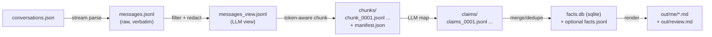

# FactWeaver Engineering Design

Status: Draft  
Scope: local ChatGPT exports → auditable “about me” knowledge base → deterministic Markdown views

This document turns `docs/memory-extraction-pipeline.md` into concrete engineering decisions: repo layout, tool interfaces, file formats, and operational safety.

## 1) Goals / non-goals

Goals:
- Extract user-specific “about me” knowledge from `conversations.json` / `shared_conversations.json`.
- Keep outputs **auditable**: every fact traces back to specific message IDs + timestamps.
- Keep runs **resumable** and **incremental** (re-run only what changed).
- Render deterministic, diff-friendly Markdown views for review and editing.
- Keep the repo safe to publish (no private exports/artifacts committed).

Non-goals:
- “Perfect truth”. Conflicts/uncertainty are surfaced for review instead of silently resolved.
- A full UI/search app (initially). This is a local pipeline + Markdown renderer.
- Uploading raw chat history anywhere by default.

## 2) Safety / privacy baseline

Hard rules:
- Never commit exports (`conversations.json`, `shared_conversations.json`) or generated artifacts (`messages*.jsonl`, `chunks/`, `claims/`, `out/`, `facts.db`, etc.). These stay local and are gitignored.
- Rendered Markdown should redact secrets by default (tokens, keys, private keys, etc.).
- “About the user” facts must include at least one **user** quote as evidence; assistant text is context unless user-confirmed.

Recommended local checks before pushing:
- `git status --ignored`
- `git check-ignore -v conversations.json`

## 3) Repo layout (working + public)

Public (committed):
- `docs/` design docs, prompt templates, output skeletons
- `tools/` scripts and wrappers (no secrets)

Local-only (ignored):
- `conversations.json` / `shared_conversations.json` (or `data/` if you prefer)
- `messages.jsonl` / `messages_view.jsonl`
- `chunks/` / `claims/` / `out/`
- `facts.db` (SQLite canonical store), optional `facts.jsonl` export

## 4) Architecture overview

We do not LLM-process raw export JSON. We normalize first into a compact transcript log, then chunk.



## 5) Canonical records and file formats

### 5.1 `messages.jsonl` (raw transcript)
One line per message (verbatim text for evidence):
```json
{"conv_id":"...","title":"...","ts":1768287751.0,"role":"user","message_id":"...","text":"..."}
```

Constraints:
- Ordering must be deterministic per conversation.
- Preserve IDs + timestamps; these are the provenance keys.

### 5.2 `messages_view.jsonl` (LLM-efficient view)
Same schema as `messages.jsonl`, but with:
- optional trimming (e.g., huge pasted logs) and stable elision markers
- redaction applied for credentials/secrets (minimum viable patterns first)

### 5.3 `chunks/manifest.json`
Chunk metadata for resumability and incremental reruns:
- chunk ID, hash, included message IDs, token estimate, created timestamp, processing status

### 5.4 `claims/*.jsonl` (LLM map output)
One line per claim (atomic fact + evidence). Use `docs/prompts/claims-map-template.md` as the contract.

Key invariants:
- “About the user” claims require at least one user evidence quote.
- Assistant-derived hypotheses must be explicitly tagged and low confidence.

### 5.5 `facts.db` (SQLite canonical store)
SQLite is the canonical store for dedupe + conflicts + evidence joins.

Minimum tables (subject to iteration):
- `claims_raw(chunk_id TEXT, claim_json TEXT, inserted_at REAL)`
- `facts(fact_id TEXT PRIMARY KEY, category TEXT, fact_text TEXT, stability TEXT, first_seen_ts REAL, last_seen_ts REAL, confidence_max REAL, status TEXT)`
- `evidence(fact_id TEXT, conv_id TEXT, message_id TEXT, ts REAL, role TEXT, quote TEXT, quote_hash TEXT)`
- `conflicts(fact_id_a TEXT, fact_id_b TEXT, conflict_type TEXT, reason TEXT)`

Fact identity:
- `fact_id = sha256(category + \"\\n\" + normalized_fact_text)` (normalize by trimming + collapsing whitespace; keep deterministic).

## 6) Tooling: planned “main tools” (CLI surface)

The pipeline is intentionally decomposed into small, composable tools. The design targets idempotent steps with explicit inputs/outputs.

Planned scripts (Phase 1–3):
- `tools/export_messages.py`: `conversations.json` → `messages.jsonl`
- `tools/build_view.py`: `messages.jsonl` → `messages_view.jsonl` (redaction + trimming)
- `tools/chunk_messages.py`: `messages_view.jsonl` → `chunks/` (+ manifest)
- `tools/extract_claims.py`: `chunks/` → `claims/` (LLM map step; provider/driver abstracted)
- `tools/merge_claims.py`: `claims/` → `facts.db` (dedupe + conflicts + evidence)
- `tools/render_md.py`: `facts.db` → `out/me/*.md` + `out/review.md`

Existing:
- `tools/count_tokens.py`: token counts for large inputs using `tiktoken`

Design principle:
- Each tool writes outputs atomically (temp file → rename) and records a manifest/hash so reruns skip unchanged units.

## 7) Windows/WSL bridging strategy (agent-friendly)

We’ll keep a clean separation:
- Pipeline data artifacts are OS-agnostic files (JSONL, SQLite, Markdown).
- When we need to rely on a **Windows** toolchain (credentials, system-installed tooling), we run it through a wrapper.

Current pattern (already in repo):
- `tools/win` runs a command in Windows PowerShell from the repo root.
- `tools/gitw` is a convenience wrapper: `bash tools/gitw <git args...>`.

Future expansion (when needed):
- Add wrappers for other Windows-native commands (e.g., `node`, `npm`, `python`), keeping the calling convention consistent.
- Add a `tools/doctor` preflight to validate required tooling and auth state before running long jobs.

## 8) Milestones (implementation order)

Phase 1 (data plane):
- Export + normalize messages deterministically
- Build view + redaction
- Token-aware chunking + manifest

Phase 2 (extraction plane):
- Claim extraction per chunk (LLM map)
- Merge/dedupe into SQLite + conflict surfacing

Phase 3 (presentation):
- Render deterministic Markdown views + review queue

Phase 4 (hardening):
- Better redaction, better heuristics for chunking, and tighter provenance tooling.

## 9) Open decisions (explicitly tracked)

- Tokenizer alignment: `tiktoken` `o200k_base` with margin vs exact model tokenizer.
- LLM provider interface: which model(s), how to store run metadata, and retry semantics.
- Redaction scope: redact in Markdown only vs also in the canonical store.
- Review workflow: auto-accept high-confidence user-asserted facts vs manual approval gate.

