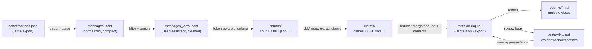

# Personal Memory Extraction Pipeline (ChatGPT Export)

Status: Draft for review  
Scope: `conversations.json` → extracted “about me” knowledge base → multiple Markdown views

## 1) Problem statement

We have a large ChatGPT export (`conversations.json`, ~124MB, ~40.7M tokens when counted as raw JSON with `o200k_base`). We want to extract information about the user (“about me”), including **stable facts** (e.g., identity, preferences) and **transient goals** (e.g., current projects, near-term plans), and write it into multiple `.md` files.

Constraints:
- The extraction will be run locally via terminal agents (Codex-like workflow) using a smaller model with ~200k–250k context per session.
- We want a pipeline that is **resumable**, **auditable** (facts trace back to evidence), and **cost/time efficient** (avoid wasting context on JSON scaffolding).

## 2) Goals / non-goals

### Goals
- Stream and normalize the export into a compact, structured message log.
- Include assistant answers for richer context, but **ground “facts about the user” in user messages**.
- Chunk input to fit model context (target: 200k–250k), without splitting in the middle of messages.
- Extract “memory claims” as structured data with evidence and timestamps.
- Merge/dedupe claims across chunks, preserving conflicts and time evolution.
- Generate multiple Markdown outputs from the canonical store.
- Make the whole run resumable + incremental (only re-run what changed).

### Non-goals
- Perfect semantic truth. The system should surface uncertain/conflicting items for review rather than “deciding” silently.
- Full retrieval/search UI. We focus on a reliable extraction + rendering pipeline.

## 3) Proposed architecture (high level)

### Key idea
Do **not** chunk or LLM-process the raw JSON. First convert it into a compact “transcript log” (JSONL), then chunk on that.

### Data flow diagram (Mermaid)



## 4) Input specifics (ChatGPT export)

The export is an array of “conversation” objects. Each conversation includes:
- `conversation_id`, `title`, `create_time`, `update_time`
- `mapping`: a node graph keyed by node IDs. Each node can contain a `message` object and links to `parent`/`children`.

Messages of interest:
- `message.author.role`: typically `user`, `assistant`, `system`, `tool`/`function`
- `message.content.content_type`: usually `text` with `parts[]` containing strings

Normalization must:
- Traverse `mapping` into a **linear ordered list** of messages.
- Drop empty system scaffolding nodes (common).
- Keep message IDs and timestamps for provenance.

## 5) Normalization stage (streaming, resumable)

### Output format: `messages.jsonl`
One line per message:
```json
{"conv_id":"...","title":"...","ts":1768287751.0,"role":"user","message_id":"...","text":"..."}
```

Implementation notes:
- Prefer a streaming JSON parser (e.g., `ijson`) to iterate conversations without loading the whole file.
- For each conversation:
  - Identify the root(s) (commonly `client-created-root`) and traverse children.
  - If multiple branches exist, prefer the main path ending at `current_node`, or sort by `message.create_time` as fallback.
  - Normalize text by joining `content.parts` with `\n` and stripping trailing whitespace.
  - Keep raw `text` unchanged for evidence; create a separate “view” for LLM processing (next section).

Resumability:
- Emit `messages.jsonl` in append mode and also write a `manifest.json` recording processed `conv_id`s and a hash of their source node IDs.
- Allow restarting without reprocessing completed conversations.

## 6) Filtering + “LLM view” preparation

We maintain two representations:

1) **Raw** (`messages.jsonl`): verbatim text, for provenance and quoting.
2) **View** (`messages_view.jsonl`): cleaned + optionally trimmed for LLM efficiency:
   - Remove repeated boilerplate (e.g., huge pasted logs) beyond a threshold.
   - Optionally collapse code blocks longer than N lines to: “(code block omitted: sha256=…, lines=…)”.
   - Preserve enough context to infer goals/projects without blowing context.

Role policy:
- Keep `user` + `assistant` messages.
- Drop most `system` unless it contains meaningful content (rare).
- Keep tool/function messages only if they convey user-specific context (optional).

Grounding policy:
- A claim is “about the user” only if evidence includes a **user** message quote.
- Assistant messages can be used as context to interpret user messages, and can generate “derived” items, but those must be tagged as `derived` unless user-confirmed.

## 7) Token-aware chunking strategy

### Primary sharding: by conversation
Process one conversation at a time. Most conversations will fit within 200k–250k context once normalized.

### Secondary chunking: within a long conversation
If a conversation exceeds the input budget:
- Accumulate whole messages until `input_budget` reached.
- Do not split mid-message.
- If a single message is too large: split by paragraphs and/or code blocks into deterministic parts:
  - `part_index`, `part_count`, and `split_reason` must be recorded.

### Budgeting guideline (for 200k–250k context model)
Reserve tokens for:
- System/prompt/instructions overhead: ~5k–15k
- Output (claims): ~10k–30k (varies with desired density)

Conservative default:
- `input_budget = 180k`
- `output_reserve = 20k`

Token counting:
- Use a tokenizer close to the target model. If that’s unavailable, use `tiktoken` `o200k_base` as an approximation and keep safety margin.

Output: `chunks/chunk_XXXX.jsonl` + `chunks/manifest.json`
Each chunk manifest entry includes:
- `chunk_id`, `hash`, `conv_ids`, `message_ids`, `token_estimate`, `created_at`, `status`

## 8) Extraction (LLM map step)

### Output format: “claims” JSONL
One line per extracted claim:
```json
{
  "category":"goals.transient",
  "fact":"Building a pipeline to extract personal info from ChatGPT export",
  "stability":"transient",
  "confidence":0.74,
  "time":{"as_of_ts":1768298947.6},
  "evidence":[
    {"role":"user","quote":"...","conv_id":"...","message_id":"...","ts":1768298800.1}
  ],
  "derived_from":"user",
  "notes":"Optional"
}
```

Recommended categories (extensible):
- `identity.*` (name, handle, language, timezone)
- `preferences.*` (tools, coding style, UI preferences)
- `work.*` (role, domains, systems)
- `projects.*` (project names, stacks, repo paths)
- `goals.transient` (current goals / short-term plans)
- `decisions.*` (explicit choices you made, accepted plans)
- `constraints.*` (hard requirements, dislikes, “don’t do X”)
- `meta.*` (how you like the assistant to work)

### Prompting requirements (to reduce hallucination)
- Require **at least one user quote** for any user-asserted claim.
- Allow assistant-derived “hypotheses” only if tagged as `derived_from=assistant` and `confidence <= 0.5` unless later confirmed.
- Ask for atomic claims (one fact per line) to simplify dedupe.
- Require timestamps and source IDs in evidence.

## 9) Merge/dedupe (reduce step)

### Canonical store: SQLite (`facts.db`)
Why SQLite:
- Efficient incremental upserts
- Easy dedupe queries
- Durable, resumable, and auditable

Suggested tables:
- `claims_raw(chunk_id, claim_json, inserted_at)`
- `facts(fact_id, category, fact_text, stability, first_seen_ts, last_seen_ts, confidence_max, status)`
- `evidence(fact_id, conv_id, message_id, ts, role, quote, quote_hash)`
- `conflicts(fact_id_a, fact_id_b, conflict_type, reason)`

Fact identity (`fact_id`):
- Hash of `(category, normalized_fact_text)` where normalization lowercases, trims, collapses whitespace, removes surrounding punctuation.
- For time-sensitive goals, include a coarse time bucket in the hash (e.g., month) to avoid over-merging distinct goals across years.

Conflict handling:
- Store conflicting facts rather than deleting one.
- Mark `status=needs_review` when:
  - Two high-confidence facts contradict
  - A fact changes over time (e.g., “preferred editor is X” → later “now I use Y”)

## 10) Markdown rendering

Generate human-readable views from the canonical store, for example:
- `out/me/identity.md`
- `out/me/preferences.md`
- `out/me/projects.md`
- `out/me/goals.md` (transient, ordered by recency)
- `out/me/constraints.md`
- `out/review.md` (conflicts + low-confidence + assistant-derived)

Rendering rules:
- Facts grouped by category/subcategory.
- Each fact includes: `as_of` (last_seen), `confidence`, and a short evidence quote with source IDs.
- Provide a “diff-friendly” deterministic ordering (category → stable/transient → recency → fact_id).

## 11) Operational concerns

### Performance
- Stream parsing avoids loading the 124MB export into RAM.
- Per-conversation processing keeps working sets small.
- Chunk manifests + hashes allow incremental re-runs.

### Safety / privacy
- The pipeline will surface sensitive strings (emails, keys) if present in chats.
- Add a redaction layer in `messages_view.jsonl` for patterns like:
  - API keys, JWTs, `BEGIN PRIVATE KEY`, access tokens
  - emails/phone numbers (optional)
- Keep raw evidence available locally, but render redacted evidence in Markdown by default.

### Observability
- Write simple progress logs: conversations processed, chunks produced, claims count, facts merged.
- Persist run metadata (`run_id`, model, prompts used, timestamp).

## 12) Implementation plan (phased)

Phase 1: Build the “data plane”
- `tools/export_messages.py` → `messages.jsonl`
- `tools/build_view.py` → `messages_view.jsonl` (+ redaction)
- `tools/chunk_messages.py` → `chunks/` + manifest

Phase 2: Extraction plane
- `tools/extract_claims.py` → runs the agent on each chunk → `claims/`
- `tools/merge_claims.py` → SQLite + dedupe + conflicts

Phase 3: Presentation
- `tools/render_md.py` → `out/me/*.md` + `out/review.md`

Phase 4: Iteration + quality
- Improve redaction, chunk sizing heuristics, and claim taxonomy based on review feedback.

## 14) Prompt + output templates (for faster review)

This section provides ready-to-use templates so you can start running the pipeline and reviewing outputs immediately.

- Claim extraction prompt template: `docs/prompts/claims-map-template.md`
- Optional consolidation prompt template: `docs/prompts/claims-reduce-template.md`
- Example rendered Markdown skeletons: `docs/output-skeletons/`

## 13) Open questions (decisions needed)

1) Tokenizer alignment: do we need a tokenizer matching the exact model, or is `o200k_base` sufficient with margin?
2) Context inclusion: keep assistant messages always, or only adjacent assistant replies to user messages?
3) Redaction policy: do we redact in Markdown only, or also in the canonical store?
4) Claim acceptance: should the pipeline auto-accept high-confidence user-asserted facts, or require manual approval for everything?

---

## Appendix A: Quick review checklist

Use this as a review rubric on the first run to quickly tighten quality.

### A.1 Evidence quality
- Each “about the user” fact includes at least one **user** quote in evidence.
- Evidence quotes are short, specific, and include `conv_id` + `message_id`.
- If a fact is derived/inferred, it is marked `derived_from=assistant` (or `derived_from=derived`) and appears in `out/review.md`.

### A.2 Dedupe and conflicts
- Similar facts are merged (same meaning, different wording).
- Conflicts are preserved and flagged `needs_review` (do not silently discard).
- Transient goals are not over-merged across long time spans (recency matters).

### A.3 Redaction
- Tokens/secrets are redacted in rendered Markdown by default.
- Raw evidence remains local-only and never leaves the machine.

### A.4 Output usefulness
- `out/me/goals.md` reads like a timeline (recent first).
- `out/me/projects.md` captures stack + repo paths + status when available.
- `out/review.md` is short enough to actually review (low-confidence and conflicts only).
